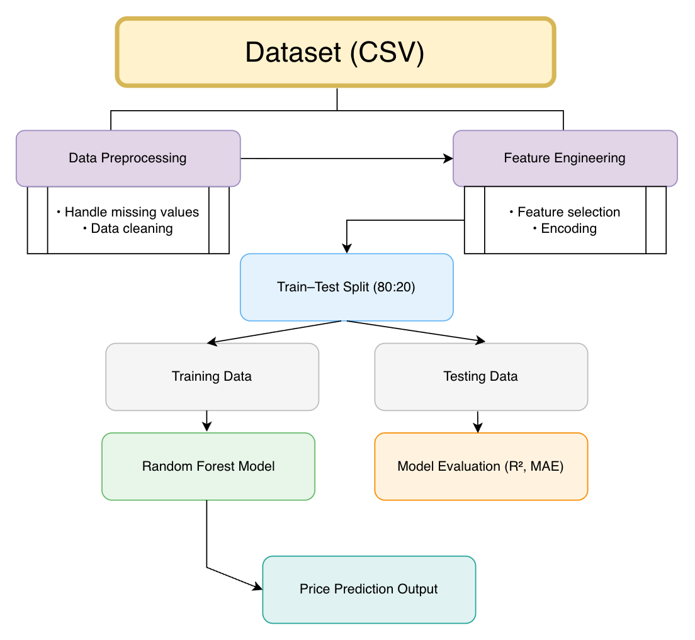

# Property Valuation & Agentic Advisor

Academic project focused on real-estate price prediction and an AI-driven advisory system.

## Project Goal
To develop a system that predicts property values using historical datasets and provides an advisor agent for investment recommendations.

### Key Milestones

#### Phase 1: ML Price Prediction
- Preprocessing and feature engineering on housing datasets.
- Regressors: Random Forest and Linear Regression.
- Deployment of a Streamlit UI for price estimation.
- Metrics: MAE, RMSE, and R².

#### Phase 2: Agentic Advisory System
- Reasoning layer using LangGraph.
- RAG for incorporating market trends and local regulations.
- Structured PDF reports with investment breakdown.
- Validation logic for noisy data.

## System Architecture



## Technology Stack
- **Programming Language**: Python
- **Machine Learning**: scikit learn, pandas, numpy
- **Visualization**: matplotlib, seaborn
- **Agent Orchestration**: LangGraph
- **Retrieval-Augmented Generation (RAG)**: FAISS (vector store)
- **Interface**: Streamlit
- **Deployment**: Streamlit Cloud / Hugging Face Spaces

## Data Sources
- [Housing Prices Dataset](https://www.kaggle.com/datasets/yasserh/housing-prices-dataset)
- [Dataful India](https://dataful.in/datasets/17611/)

## Local Installation

1. **Clone & Enter**
   ```bash
   git clone https://github.com/NssGourav/property-valuation-agentic-advisor.git
   ```
   ```bash
   cd property-valuation-agentic-advisor
   ```

2. **Environment Setup**
   ```bash
   python -m venv venv
   source venv/bin/activate
   pip install -r requirements.txt
   ```

3. **Run App**
   ```bash
   streamlit run app.py
   ```

## Team
- **Nss Gourav**
- **Subham Sangwan**

---
*Developed for Project 9: Intelligent Property Price Prediction.*
